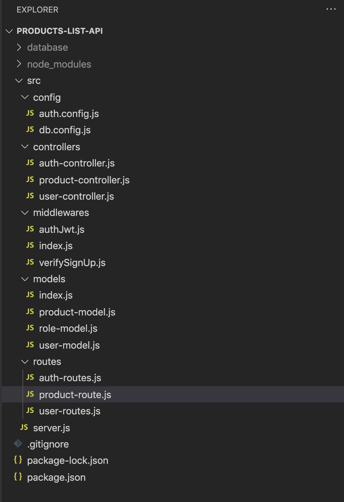

# products-list-api

Clone this repository and Start the mongo server by giving the database/data/db folder of the server code as dbpath :
# mongod --port 27018 —dbpath ./data/db

In another terminal start an instance
# mongo

In another terminal install packages and start the server
# npm install
# node server 
or
# nodemon server 

keep the mongo shell and instan
